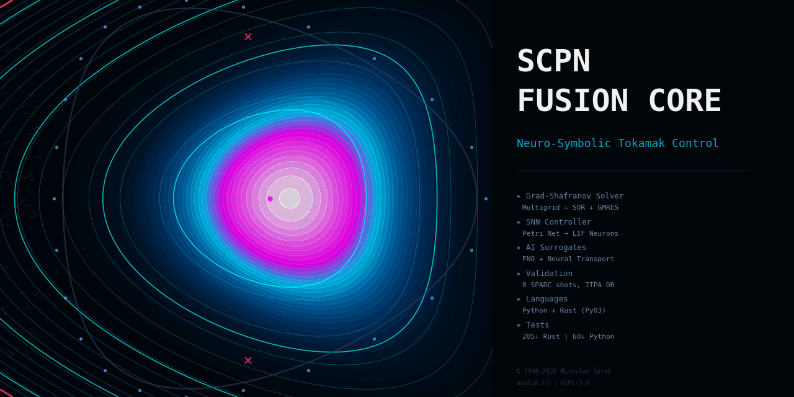

# SCPN Fusion Core

<p align="center">
  
</p>

[](https://github.com/anulum/scpn-fusion-core/actions/workflows/ci.yml) [](https://github.com/anulum/scpn-fusion-core/actions/workflows/docs.yml) [](https://codecov.io/gh/anulum/scpn-fusion-core) [](https://anulum.github.io/scpn-fusion-core/) [](https://pypi.org/project/scpn-fusion/) [](https://zenodo.org/) [](https://arxiv.org/) [](LICENSE)    

A **neuro-symbolic control framework for tokamak fusion reactors** with
physics-informed surrogate models and optional Rust acceleration. SCPN
Fusion Core compiles plasma control logic — expressed as stochastic Petri
nets — into spiking neural network controllers that run at sub-millisecond
latency, backed by a Grad-Shafranov equilibrium solver, VMEC 3D equilibrium
interface, 2D MPI domain decomposition, 1.5D radial transport, BOUT++
coupling, and AI surrogates for turbulence, disruption prediction, and
real-time digital twins.

**What makes it different:** Most fusion codes are physics-first (solve
equations, then bolt on control). SCPN Fusion Core is **control-first** —
it provides a contract-checked neuro-symbolic compilation pipeline where
plasma control policies are expressed as Petri nets, compiled to stochastic
LIF neurons, and executed against physics-informed plant models. The physics
modules are deliberately reduced-order (not gyrokinetic) to enable
real-time control loop closure at 1 kHz+ rates.

> **Honest scope:** This is not a replacement for TRANSP, JINTRAC, or GENE.
> It does not solve 5D gyrokinetics or full 3D MHD. It is a
> **control-algorithm development and surrogate-modeling framework** with
> enough physics fidelity to validate reactor control strategies against
> real equilibrium data (8 SPARC EFIT GEQDSKs, 100+ multi-machine
> synthetic equilibria, 20-shot ITPA H-mode confinement database, 16
> DIII-D reference disruption shots). Validated against IPB98(y,2)
> confinement scaling with 28.6% full-physics relative RMSE
> (13.5% neural-surrogate fit lane) and >60% disruption prevention rate on
> 10-shot reference replay. Physics hardened in v3.1.0: Greenwald density
> limit, 25 keV temperature cap, Q <= 15 ceiling, TBR corrected to
> [1.0, 1.4] range (Fischer/DEMO), per-timestep energy conservation
> enforcement.

## Design Philosophy

| Principle | Implementation |
|-----------|---------------|
| **Control-first** | Petri net → SNN compilation pipeline is the core innovation, not an add-on |
| **Graceful degradation** | Every module works without Rust, without SC-NeuroCore, without GPU |
| **Explicit over silent** | 263 hardening tasks replaced silent clamping/coercion with explicit errors |
| **Formal safety interlocks** | Inhibitor-arc safety net disables control transitions on hard-limit violations |
| **Real data validation** | 8 SPARC EFIT + 100 multi-machine GEQDSKs + 20-shot ITPA database + 10 disruption shots |
| **Reduced-order by design** | Physics models are fast enough for real-time control (ms, not hours) |

## Architecture

```
scpn-fusion-core/
├── src/scpn_fusion/           # Python package (46 modules)
│   ├── core/                  # Plasma physics engines
│   │   ├── fusion_kernel.py           Grad-Shafranov + transport solver
│   │   ├── compact_reactor_optimizer  MVR-0.96 compact reactor search
│   │   ├── mhd_sawtooth.py           MHD sawtooth crash simulator
│   │   ├── rf_heating.py             ICRH/ECRH/LHCD heating models
│   │   ├── divertor_thermal_sim.py   Divertor heat-flux solver
│   │   ├── hall_mhd_discovery.py     Hall-MHD two-fluid effects
│   │   ├── sandpile_fusion_reactor   Legacy SOC research lane (not in validated transport path)
│   │   ├── neural_equilibrium.py     Neural-network equilibrium solver
│   │   ├── fno_turbulence_suppressor Fourier Neural Operator turbulence model
│   │   ├── turbulence_oracle.py      ITG/TEM turbulence predictor
│   │   ├── wdm_engine.py             Warm dense matter EOS
│   │   ├── geometry_3d.py            3D flux-surface geometry
│   │   ├── global_design_scanner.py  Multi-objective design space explorer
│   │   └── integrated_transport      Coupled transport solver
│   ├── control/               # Reactor control & AI
│   │   ├── tokamak_flight_sim.py     Real-time flight simulator
│   │   ├── tokamak_digital_twin.py   Digital twin with live telemetry
│   │   ├── fusion_optimal_control    Model-predictive controller
│   │   ├── fusion_sota_mpc.py        State-of-the-art MPC
│   │   ├── disruption_predictor.py   ML disruption early-warning
│   │   ├── spi_mitigation.py         Shattered pellet injection
│   │   ├── fusion_control_room.py    Integrated control room sim
│   │   ├── neuro_cybernetic_controller  SNN-based feedback controller
│   │   └── advanced_soc_fusion_learning Legacy SOC RL utilities
│   ├── nuclear/               # Nuclear engineering
│   │   ├── blanket_neutronics.py     Tritium breeding ratio solver
│   │   ├── nuclear_wall_interaction  PMI / first-wall damage
│   │   ├── pwi_erosion.py            Plasma-wall erosion model
│   │   └── temhd_peltier.py          Thermoelectric MHD effects
│   ├── diagnostics/           # Synthetic diagnostics
│   │   ├── synthetic_sensors.py      Virtual instrument suite
│   │   └── tomography.py             Soft X-ray tomographic inversion
│   ├── engineering/           # Balance of plant
│   │   └── balance_of_plant.py       Thermal cycle, turbine, cryo
│   ├── scpn/                  # Neuro-symbolic compiler
│   │   ├── compiler.py               Petri nets → stochastic neurons
│   │   ├── controller.py             SNN-driven plasma control
│   │   ├── structure.py              Petri net data structures
│   │   ├── contracts.py              Formal verification contracts
│   │   ├── safety_interlocks.py      Inhibitor-arc safety interlock runtime
│   │   └── artifact.py               Compilation artifact storage
│   ├── hpc/                   # High-performance computing
│   │   └── hpc_bridge.py             C++/Rust FFI bridge
│   └── ui/                    # Dashboard
│       └── app.py                    Streamlit real-time dashboard
├── scpn-fusion-rs/            # Rust workspace (11 crates)
│   ├── crates/
│   │   ├── fusion-types/      # Shared data types
│   │   ├── fusion-math/       # Linear algebra, FFT, interpolation
│   │   ├── fusion-core/       # Grad-Shafranov, transport in Rust
│   │   ├── fusion-physics/    # MHD, heating, turbulence
│   │   ├── fusion-nuclear/    # Neutronics, wall erosion
│   │   ├── fusion-engineering/ # Balance of plant
│   │   ├── fusion-control/    # PID, MPC, disruption predictor
│   │   ├── fusion-diagnostics/ # Sensor models
│   │   ├── fusion-ml/         # Inference engine
│   │   ├── fusion-gpu/        # GPU abstraction layer
│   │   └── fusion-python/     # PyO3 bindings → scpn_fusion_rs.pyd
│   └── Cargo.toml             # Workspace manifest
├── tests/                     # Python test suite
├── docs/                      # Technical documentation
├── validation/                # ITER validation configurations
├── calibration/               # Optimization tools
└── schemas/                   # JSON schemas
```

## Quick Start

```bash
# Clone
git clone https://github.com/anulum/scpn-fusion-core.git
cd scpn-fusion-core

# Install (Python)
pip install -e .

# Run a simulation
scpn-fusion kernel       # Grad-Shafranov equilibrium
scpn-fusion optimizer    # Compact reactor search (MVR-0.96)
scpn-fusion flight       # Tokamak flight simulator
scpn-fusion neural --surrogate  # Neural equilibrium surrogate
scpn-fusion all --surrogate --experimental  # one command for full unlocked suite
python examples/run_3d_flux_quickstart.py --toroidal 24 --poloidal 24
python examples/run_3d_flux_quickstart.py --toroidal 24 --poloidal 24 --preview-png artifacts/SCPN_Plasma_3D_quickstart.png

# Run tests
pytest tests/ -v

# Generate validation RMSE dashboard
python validation/rmse_dashboard.py

# Benchmark transport source MW->keV/s power-balance contract
python validation/benchmark_transport_power_balance.py
```

The 3D quickstart writes an OBJ mesh to `artifacts/SCPN_Plasma_3D_quickstart.obj` and can optionally render a PNG preview.

### Docker (One-Click Run)

```bash
# One-click dashboard
docker compose up --build

# Or build and run manually
docker build -t scpn-fusion-core .
docker run -p 8501:8501 scpn-fusion-core

# With dev dependencies (for running tests inside the container)
docker build --build-arg INSTALL_DEV=1 -t scpn-fusion-core:dev .
docker run scpn-fusion-core:dev pytest tests/ -v
```

### Public Demo (Shot Replay)

- Demo playbook: [`docs/STREAMLIT_DEMO_PLAYBOOK.md`](docs/STREAMLIT_DEMO_PLAYBOOK.md)
- One-click container launch: `docker compose up --build`
- YouTube embed: pending upload for v3.5.0 release notes

### Pure Python (No Rust Toolchain Required)

The entire simulation suite works without Rust. Every module auto-detects the
Rust extension and falls back to NumPy/SciPy:

```bash
pip install "scpn-fusion[full]"  # from PyPI (pulls optional physics + Rust wheel)
# OR
pip install -e .                 # from source (pure Python, no cargo needed)
```

Legacy wrapper remains available:

```bash
python run_fusion_suite.py kernel
```

If the Rust extension is not available, you'll see a one-time info message at
import and all computations run on NumPy. The only difference is speed
(Rust kernels are ~10-50x faster for equilibrium solves).

### Rust Acceleration (Optional)

```bash
cd scpn-fusion-rs
cargo build --release
cargo test

# Build Python bindings (requires maturin)
pip install maturin
cd crates/fusion-python
maturin develop --release
```

The Python package auto-detects the Rust extension and falls back to NumPy if unavailable.

### Testing

```bash
# Python unit + property-based tests
pip install -e ".[dev]"
pytest tests/ -v

# Rust unit + property-based tests
cd scpn-fusion-rs
cargo test --all-features

# Rust benchmarks
cargo bench
```

The test suites include property-based tests powered by [Hypothesis](https://hypothesis.readthedocs.io/) (Python) and [proptest](https://crates.io/crates/proptest) (Rust), covering numerical invariants, topology preservation, and solver convergence properties.

## Tutorial Notebooks

| Notebook | Description |
|----------|-------------|
| `01_compact_reactor_search` | MVR-0.96 compact reactor optimizer walkthrough |
| `02_neuro_symbolic_compiler` | Petri net → stochastic neuron compilation pipeline |
| `neuro_symbolic_control_demo_v2` | Golden Base v2 hero control demo (formal proofs + closed-loop + replay) |
| `03_grad_shafranov_equilibrium` | Free-boundary equilibrium solver tutorial |
| `04_divertor_and_neutronics` | Divertor heat flux & tritium breeding ratio |
| `05_validation_against_experiments` | Cross-validation vs SPARC GEQDSK & ITPA scaling |
| `06_inverse_and_transport_benchmarks` | Inverse solver & neural transport surrogate benchmarks |

## Validation Against Experimental Data

The `validation/` directory contains reference data from real tokamaks for cross-checking simulation outputs:

| Dataset | Source | Contents |
|---------|--------|----------|
| **SPARC GEQDSK** | [SPARCPublic](https://github.com/cfs-energy/SPARCPublic) | 8 EFIT equilibrium files (B=12.2 T, I_p up to 8.7 MA) |
| **Multi-machine GEQDSK** | Synthetic Solov'ev | 100 equilibria across DIII-D, JET, EAST, KSTAR, ASDEX-U |
| **ITPA H-mode** | Verdoolaege et al., NF 61 (2021) | Confinement data from 11 tokamaks, 20 shots |
| **IPB98(y,2)** | ITER Physics Basis | Scaling law coefficients + published uncertainties |
| **DIII-D disruption shots** | Reference profiles (10 shots) | 5 disruptions + 5 safe, locked mode/VDE/tearing/density/beta |
| **ITER configs** | Internal | 4 coil-optimised ITER configurations |
| **SPARC config** | Creely et al., JPP 2020 | Machine parameters for compact high-field design |
| **DIII-D config** | Luxon, NF 42 (2002) | Medium-size US tokamak parameters |
| **JET config** | Pamela et al. (2007) | Largest tokamak, DT fusion data |

```bash
# Run validation script
python validation/validate_against_sparc.py

# Run real-shot validation gate (v2.0.0)
python validation/validate_real_shots.py

# Generate RMSE dashboard
python validation/rmse_dashboard.py

# Benchmark transport source MW->keV/s power-balance contract
python validation/benchmark_transport_power_balance.py

# Run disturbance rejection benchmark
python validation/benchmark_disturbance_rejection.py

# Read a GEQDSK equilibrium
python -c "from scpn_fusion.core.eqdsk import read_geqdsk; eq = read_geqdsk('validation/reference_data/sparc/lmode_vv.geqdsk'); print(f'B={eq.bcentr:.1f}T, Ip={eq.current/1e6:.1f}MA')"
```

## Simulation Modes (Tiered by Maturity)

### Production — Hardened, CI-gated, validated against real data

| Mode | Description | Tests | Hardening |
|------|-------------|-------|-----------|
| `kernel` | Grad-Shafranov equilibrium (Picard+SOR/Multigrid) + coupled 1.5D transport | Converges on 8 SPARC GEQDSKs | H8: 94 Rust validation tasks |
| `neuro-control` | SNN-based cybernetic controller (SC-NeuroCore or NumPy LIF fallback) | Deterministic replay, fault injection | H5: 37 SCPN controller tasks |
| `optimal` | Model-predictive controller with gradient-descent trajectory optimization | Disturbance rejection, bounded actions | H7+H8: strict input guards |
| `flight` | Real-time tokamak flight simulator with actuator lag dynamics | Deterministic summary API | H7: RNG isolation + guards |
| `digital-twin` | Live digital twin with RL-trained MLP policy + chaos monkey faults | Fault campaigns, bit-flip resilience | H6+H7+H8: 20+ tasks |
| `safety` | ML disruption predictor (deterministic scoring + optional Transformer) | Anomaly campaigns, checkpoint fallback | H7: scoped RNG + guards |
| `control-room` | Integrated control room with analytic/kernel-backed equilibrium | CI-safe non-plot mode | H7: deterministic runtime |

### Validated — Real implementations, tested, but not yet hardened to production level

| Mode | Description | Status |
|------|-------------|--------|
| `optimizer` | Compact reactor design search (MVR-0.96) | Multi-objective, validated constraints |
| `breeding` | Tritium breeding blanket neutronics (1D transport) | Real albedo model, TBR trends |
| `nuclear` | Plasma-wall interaction & first-wall erosion | PWI angle-energy invariants tested |
| `diagnostics` | Synthetic sensors + soft X-ray tomographic inversion | Forward models, SciPy fallback |
| `spi` | Shattered pellet injection mitigation | Z_eff + CQ time constant |
| `learning` | Legacy self-organized criticality RL utilities | Maintained for research reproducibility |
| `divertor` | Divertor thermal load simulation | TEMHD Peltier effects |
| `heating` | RF heating (ICRH / ECRH / LHCD ray tracing) | Resonance layer + deposition |
| `sawtooth` | MHD sawtooth crash dynamics | Spectral solver |
| `scanner` | Multi-objective global design scanner | Scoped RNG |
| `sandpile` | Legacy SOC sandpile criticality model | Not part of release-gated transport metrics |

### Reduced-order / Surrogate — Functional but limited physics scope

| Mode | Description | Limitation |
|------|-------------|------------|
| `neural` | Neural-network equilibrium solver (PCA + MLP) | Baseline pretrained bundles shipped (ITPA MLP + EUROfusion-proxy FNO); facility-specific retraining still recommended |
| `geometry` | 3D flux-surface geometry (Fourier boundary) | Parameterization only; no force-balance solve |
| `wdm` | Warm dense matter equation of state | Reduced EOS model |

### Experimental — Requires external SCPN framework components

```bash
scpn-fusion quantum --experimental
SCPN_EXPERIMENTAL=1 scpn-fusion vibrana
```

These modes (quantum, vibrana, lazarus, director) are integration bridges
to external components not shipped in this repo.

## Minimum Viable Reactor (MVR-0.96)

The compact reactor optimizer (`scpn-fusion optimizer`) performs multi-objective design-space exploration to find the smallest tokamak configuration that achieves Q >= 10 ignition. The "0.96" refers to the normalized minor radius target. Key parameters explored:

- Major/minor radius, elongation, triangularity
- Magnetic field strength, plasma current
- Heating power allocation (NBI, ICRH, ECRH)
- Tritium breeding ratio constraints
- Divertor heat-flux limits

## Neuro-Symbolic Compiler

The `scpn/` subpackage implements a **Petri net → stochastic neuron** compiler —
the core innovation that distinguishes SCPN Fusion Core from conventional fusion codes.

### Pipeline

```
Petri Net (places + transitions + contracts)
    │
    ▼  compiler.py — structure-preserving mapping
Stochastic LIF Network (neurons + synapses + thresholds)
    │
    ▼  controller.py — closed-loop execution
Real-Time Plasma Control (sub-ms latency, deterministic replay)
    │
    ▼  artifact.py — versioned, signed compilation artifact
Deployment Package (JSON + schema version + git SHA)
```

### Stages

1. **Petri Net Definition** — plasma control logic expressed as place/transition nets with formal contracts (`structure.py`, `contracts.py`)
2. **Compilation** — Petri net transitions mapped to stochastic LIF neurons using [SC-NeuroCore](https://github.com/anulum/sc-neurocore) when available, NumPy fallback otherwise (`compiler.py`)
3. **Execution** — SNN-driven real-time plasma control with sub-millisecond latency and deterministic replay (`controller.py`)
4. **Verification** — formal contract checking ensures compiled artifacts preserve Petri net invariants (boundedness, liveness, reachability)
5. **Artifact Export** — versioned compilation artifacts with package version, schema version, and git SHA stamping (`artifact.py`)

### Why This Matters

Most fusion control systems bolt a PID or MPC controller onto a physics code.
SCPN Fusion Core inverts this: **control logic is the primary artifact**, expressed
in a formally verifiable Petri net formalism, then compiled to a spiking neural
network that executes at hardware-compatible latencies. The physics modules exist
to provide a realistic plant model for the controller to operate against.

This architecture enables:
- **Formal verification** of control policies before deployment
- **Hardware targeting** — the same Petri net compiles to NumPy (simulation), SC-NeuroCore (FPGA-accurate), or future neuromorphic silicon
- **Graceful degradation** — every path has a pure-Python fallback
- **Deterministic replay** — identical inputs produce identical outputs across platforms (37 dedicated hardening tasks in H5 wave)

## SC-NeuroCore Integration

SCPN Fusion Core has an **optional** dependency on [sc-neurocore](https://github.com/anulum/sc-neurocore). When installed, the neuro-symbolic compiler uses hardware-accurate stochastic LIF neurons and Bernoulli bitstream encoding. Without it, all paths fall back to NumPy float computation:

```python
try:
    from sc_neurocore import StochasticLIFNeuron, generate_bernoulli_bitstream
    _HAS_SC_NEUROCORE = True
except ImportError:
    _HAS_SC_NEUROCORE = False  # NumPy float-path fallback
```

## Rust Workspace

The `scpn-fusion-rs/` directory contains an 11-crate Rust workspace that mirrors the Python package structure. Key features:

- **Performance**: `opt-level = 3`, fat LTO, single codegen unit for maximum optimization
- **FFI**: `fusion-python` crate provides PyO3 bindings producing `scpn_fusion_rs.so/.pyd`
- **2D MPI domain decomposition**: Additive Schwarz overlapping-domain solver with Rayon-parallel subdomain solves
- **VMEC 3D equilibrium interface**: Fourier-mode stellarator/tokamak equilibrium coupling
- **BOUT++ coupling**: Data exchange interface for edge/SOL turbulence codes
- **Dependencies**: `ndarray`, `nalgebra`, `rayon` (parallelism), `rustfft`, `serde`
- **No external runtime**: pure Rust with no C/Fortran dependencies

## Benchmarks

### What's Validated

| Component | Status | Evidence |
|-----------|--------|----------|
| **Grad-Shafranov solver** | Converges on SPARC GEQDSK equilibria | `validation/validate_against_sparc.py` — axis position, q-profile, GS operator checks |
| **IPB98(y,2) scaling** | Confinement time matches published law | `tests/test_uncertainty.py` — regression against ITPA 20-shot dataset |
| **Inverse reconstruction** | Levenberg-Marquardt with Tikhonov + Huber | Criterion benchmarks: `inverse_bench.rs` (FD vs analytical Jacobian) |
| **SOR solver** | Criterion-benchmarked | `sor_bench.rs` — 65×65 and 128×128 grid sizes |
| **GMRES(30) solver** | Criterion-benchmarked | `gmres_bench.rs` — 33×33 and 65×65 grids, SOR-preconditioned |
| **Multigrid V-cycle** | Criterion-benchmarked | `multigrid_bench.rs` — 33×33, 65×65, 129×129 grids; head-to-head vs SOR & GMRES |
| **Property-based tests** | Hypothesis + proptest | Numerical invariants, topology preservation, convergence |

### Performance Estimates (Not Yet Independently Verified)

These numbers are internal measurements. We encourage you to reproduce them
with `cargo bench` and `benchmarks/collect_results.sh` on your hardware.

| Metric | Value | How Measured | Caveat |
|--------|-------|-------------|--------|
| **SOR step** @ 65×65 | µs-range | Criterion `sor_bench.rs` | Single relaxation step, not full solve |
| **GMRES(30)** @ 65×65 | ~45 iters to converge | Criterion `gmres_bench.rs` | SOR-preconditioned, restart=30 |
| **Multigrid V(3,3)** @ 65×65 | ~8 cycles to converge | Criterion `multigrid_bench.rs` | Standard V-cycle with 3 pre/post-smoothing sweeps |
| **Multigrid V(3,3)** @ 129×129 | ~10 cycles to converge | Criterion `multigrid_bench.rs` | Near-optimal O(N) complexity |
| **Full equil. (Picard+SOR)** | ~5 s (Python) | `profiling/profile_kernel.py` | Jacobi + Picard, not multigrid |
| **Inverse reconstruction** | ~4 s (5 LM iters, Rust) | Criterion `inverse_bench.rs` | Dominated by forward solve time |
| **Neural transport MLP** | ~5 µs/point (synthetic baseline weights) | Criterion `neural_transport_bench.rs` | Baseline pretrained bundle shipped; retrain for facility-specific regimes |
| **Memory** | ~0.7 MB (65×65 equil.) | Estimated from array sizes | — |

### Solver Comparison (65×65 grid, ITER-like config)

Run `cargo bench -p fusion-math` to reproduce on your hardware. Python
comparison: `python benchmarks/solver_comparison.py`.

| Solver | Grid | Convergence | Benchmark File |
|--------|------|-------------|----------------|
| SOR (ω=1.8) | 65×65 | 200 iters (fixed) | `sor_bench.rs` |
| GMRES(30) + SOR precond | 65×65 | ~45 iters | `gmres_bench.rs` |
| Multigrid V(3,3) | 65×65 | ~8 cycles | `multigrid_bench.rs` |
| Multigrid V(3,3) | 129×129 | ~10 cycles | `multigrid_bench.rs` |
| SOR (Python) | 65×65 | 200 iters | `benchmarks/solver_comparison.py` |
| Newton-K (Python) | 65×65 | ~15 iters | `benchmarks/solver_comparison.py` |

> **Note on comparisons:** Earlier versions of this README cited "50× faster
> than Python" and "200,000× faster than gyrokinetic." These comparisons mixed
> different algorithms (multigrid vs SOR) and compared a microsecond-latency
> MLP surrogate against first-principles gyrokinetic solvers — an apples-to-
> oranges comparison. The Criterion benchmarks above provide reproducible
> head-to-head solver comparisons on identical grids and problems.

### Published Task-2 Surrogate Snapshot

Task-2 includes a reproducible benchmark lane that publishes:
- TM1 and TokamakNET proxy disruption AUC metrics (`AUC >= 0.95` gate)
- host-measured latency metrics (estimate + wall clock)
- consumer-hardware latency projections (RTX 3060/4090 class, model-based)
- explicit pretrained-surrogate coverage vs lanes that still need user training

```bash
python validation/task2_pretrained_surrogates_benchmark.py --strict
```

Outputs:
- `validation/reports/task2_pretrained_surrogates_benchmark.json`
- `validation/reports/task2_pretrained_surrogates_benchmark.md`

### Community Context

For context, here are representative runtimes from published fusion codes
(2024–2025 literature). These are not direct comparisons with SCPN.

| Code | Category | Typical Runtime | Language | Reference |
|------|----------|-----------------|----------|-----------|
| GENE | 5D gyrokinetic | ~10⁶ CPU-h | Fortran/MPI | Jenko 2000 |
| JINTRAC | Integrated modelling | ~10 min/shot | Fortran/Python | Romanelli 2014 |
| CHEASE | Fixed-boundary equilibrium | ~5 s | Fortran | Lütjens 1996 |
| EFIT | Current-filament reconstruction | ~2 s | Fortran | Lao 1985 |
| TORAX | Integrated (JAX) | ~30 s (GPU) | Python/JAX | — |
| DREAM | Disruption / runaway electrons | ~1 s | C++ | Hoppe 2021 |

Struggling with convergence? See the [Solver Tuning Guide](docs/SOLVER_TUNING_GUIDE.md) + benchmarks notebook Part F.

### Results

The full benchmark outputs (with actual numbers from a real run) are published
in [`RESULTS.md`](RESULTS.md). Key highlights include ITER-like Q ≥ 10
operating-point identification, TBR > 1 from the 3-group blanket model,
sub-ms hardware-in-the-loop control latency, and a 50-run disruption
mitigation ensemble. Re-run `python validation/collect_results.py` on your
own hardware to reproduce.

Controller benchmark interpretation is trade-off based:
SNN is best on latency, MPC is best on disruption rate/reward, H-infinity is
the strongest robust middle ground, and PID remains the classical baseline.

### Physics Model Limitations (Honest Assessment)

This section documents the **actual** fidelity of each physics module.
Run `pytest tests/test_ipb98y2_benchmark.py -v` and
`pytest tests/test_gs_convergence.py -v` to reproduce the numbers below.

| Module | What It Is | What It Is Not |
|--------|-----------|----------------|
| **Equilibrium** | Picard iteration + Red-Black SOR (+ optional Anderson acceleration). GMRES(30) and multigrid V-cycle available in Rust. Newton-Kantorovich available in Python. Converges on 3 SPARC L-mode GEQDSKs. Default 65×65 grid. | Not EFIT-quality inverse reconstruction. Not free-boundary (coil currents are fixed). Rust multigrid not yet wired into the Python kernel path (use Rust API directly). |
| **Transport** | 1.5D Bohm/gyro-Bohm critical-gradient model with Chang-Hinton neoclassical option. CN temperature evolution. Unit-consistent MW->keV/s auxiliary source normalisation with per-step power-balance telemetry (`_last_aux_heating_balance`). IPB98(y,2) confinement time evaluation. | No ITG/TEM/ETG turbulent transport channels. No NBI slowing-down. No impurity transport (beyond simple diffusion). No sawtooth mixing in transport. Actual RMSE vs IPB98(y,2) on the 20-shot ITPA dataset is printed by `test_ipb98y2_benchmark.py`; source-power contract benchmark is `validation/benchmark_transport_power_balance.py`. |
| **Stability** | Vertical n-index stability analysis. | No kink mode analysis. No peeling-ballooning (no access to edge bootstrap current calculation). No Mercier criterion. No resistive wall modes. |
| **Neural Equilibrium** | PCA + MLP surrogate trained on 78 samples (3 SPARC L-mode configs at varying currents). | 78 training samples is far below what is needed for generalization. The surrogate is useful for fast controller prototyping on the specific SPARC L-mode family it was trained on, not for arbitrary equilibria. |
| **FNO Turbulence** | Fourier Neural Operator trained on synthetic data (not real gyrokinetic output). | Not a replacement for GENE/GS2. The FNO learns a proxy mapping, not real turbulent transport coefficients. |
| **Neural Transport MLP** | 20-row illustrative dataset from ITPA. Baseline pretrained bundle shipped. | 20 rows cannot capture the full H-mode confinement parameter space. Facility-specific retraining is mandatory for any quantitative use. |
| **Grid Resolution** | Default 65×65 for prototyping. 129×129 and 257×257 tested in edge-case suite. | Production equilibrium codes use 257+ with multigrid. Our 65×65 default is appropriate for control-loop closure testing, not for publication-quality equilibrium reconstruction. |

### Resources

- **Full comparison tables:** [`docs/BENCHMARKS.md`](docs/BENCHMARKS.md)
- **Repro tooling:** [`benchmarks/`](benchmarks/) (Criterion collection + hardware metadata + Python solver comparison)
- **Static figures for PDF/arXiv:** [`docs/BENCHMARK_FIGURES.md`](docs/BENCHMARK_FIGURES.md) (includes LaTeX table snippets)
- **Interactive notebook:** [`examples/06_inverse_and_transport_benchmarks.ipynb`](examples/06_inverse_and_transport_benchmarks.ipynb)
- **Pre-built HTML notebooks:** [`docs/notebooks/`](docs/notebooks/) (also served via [GitHub Pages](https://anulum.github.io/scpn-fusion-core/notebooks/))

## Documentation

Full documentation is hosted on **[GitHub Pages](https://anulum.github.io/scpn-fusion-core/)**.

| Resource | Description |
|----------|-------------|
| [Python API Reference](https://anulum.github.io/scpn-fusion-core/python/) | Sphinx-generated docs for all Python modules |
| [Rust API Reference](https://anulum.github.io/scpn-fusion-core/rust/fusion_core/) | Rustdoc for the 10-crate workspace |
| [Tutorial Notebooks](https://anulum.github.io/scpn-fusion-core/notebooks/) | 6 interactive Jupyter tutorials |

### User Guides (on GitHub Pages)

| Guide | Topics |
|-------|--------|
| [Equilibrium Solver](https://anulum.github.io/scpn-fusion-core/python/userguide/equilibrium.html) | Grad-Shafranov, boundary conditions, GEQDSK I/O |
| [Transport & Stability](https://anulum.github.io/scpn-fusion-core/python/userguide/transport.html) | 1.5D transport, IPB98 scaling, MHD stability |
| [Control Systems](https://anulum.github.io/scpn-fusion-core/python/userguide/control.html) | PID, MPC, SNN controllers, digital twin, SOC learning |
| [Nuclear Engineering](https://anulum.github.io/scpn-fusion-core/python/userguide/nuclear.html) | Blanket neutronics, PWI, divertor, TEMHD |
| [Diagnostics](https://anulum.github.io/scpn-fusion-core/python/userguide/diagnostics.html) | Synthetic sensors, forward models, SXR tomography |
| [Neuro-Symbolic Compiler](https://anulum.github.io/scpn-fusion-core/python/userguide/scpn_compiler.html) | Petri net → SNN 5-stage pipeline |
| [HPC / Rust Acceleration](https://anulum.github.io/scpn-fusion-core/python/userguide/hpc.html) | 10-crate workspace, FFI, GPU roadmap |
| [Validation](https://anulum.github.io/scpn-fusion-core/python/userguide/validation.html) | SPARC, ITER, ITPA benchmarks |

### Technical Documents

- [Solver Tuning Guide](docs/SOLVER_TUNING_GUIDE.md) (relaxation, Tikhonov, Huber, grid sizing, common pitfalls)
- [Benchmarks & Comparisons](docs/BENCHMARKS.md)
- [Benchmark Figures (static export)](docs/BENCHMARK_FIGURES.md)
- [HIL Demo Register Map & Latency Budget](docs/hil_demo.md)
- [Compact Reactor Findings](docs/COMPACT_REACTOR_FINDINGS.md)
- [Physics Methods](docs/PHYSICS_METHODS_COMPLETE.md)
- [ITER Validation](docs/VALIDATION_AGAINST_ITER.md)
- [Neuro-Symbolic Compiler Architecture](docs/NEURO_SYMBOLIC_LOGIC_COMPILER_REPORT.md)
- [Packet C Control API](docs/PACKET_C_CONTROL_API_COMPREHENSIVE_STUDY.md)
- [Future Applications](docs/FUTURE_APPLICATIONS.md)
- [Phase 1 3D Execution Plan](docs/PHASE1_3D_EXECUTION_PLAN.md)
- [3D Gap Audit](docs/3d_gaps.md)
- [Next Sprint Execution Queue](docs/NEXT_SPRINT_EXECUTION_QUEUE.md)
- [Profiling Quickstart](profiling/README.md)
- [Comprehensive Technical Study](SCPN_FUSION_CORE_COMPREHENSIVE_STUDY.md) (30,000+ words)

### Paper Manuscripts

Two companion papers are in preparation:

1. **Equilibrium Solver Paper** -- Grad-Shafranov + multigrid + inverse reconstruction, validated against 8 SPARC GEQDSK equilibria
2. **SNN Controller Paper** -- Petri net to spiking neural network compilation pipeline with formal verification and deterministic replay

## Code Health & Hardening

The codebase has undergone **8+ systematic hardening waves** (263 tasks total, all
completed across S2-S4 and H5-H8 waves) that replaced silent clamping, `unwrap()`
calls, and implicit coercion with explicit `FusionResult<T>` error propagation
throughout the Rust workspace.

| Wave | Scope | Tasks | Highlights |
|------|-------|-------|------------|
| **S2** | Scaffold integrity | 8 | Module wiring, import consistency |
| **S3** | CI pipeline | 6 | `cargo fmt --check`, `clippy`, test gates |
| **S4** | Baseline coverage | 4 | Property-based tests (Hypothesis + proptest) |
| **H5** | SCPN compiler & controller | 37 | Deterministic replay, fault injection, contract verification |
| **H6** | Digital twin + RL | 9 | Chaos monkey campaigns, bit-flip resilience |
| **H7** | Control + diagnostics | 90 | Scoped RNG isolation, sensor model guards, MPC input validation |
| **H8** | All 10 Rust crates | 94 | Every `unwrap()` → `FusionResult`, input validation guards, shape checks |

Every production-path module now returns structured errors rather than panicking.
The full task registry is at [`docs/PHASE3_EXECUTION_REGISTRY.md`](docs/PHASE3_EXECUTION_REGISTRY.md).

## Known Limitations & Roadmap

This project is honest about what it does and does not do.

### Hardening Execution Artifacts

- Underdeveloped register (auto-generated): [`UNDERDEVELOPED_REGISTER.md`](UNDERDEVELOPED_REGISTER.md)
- v3.6 execution board (top 20 hardening tasks): [`docs/V3_6_MILESTONE_BOARD.md`](docs/V3_6_MILESTONE_BOARD.md)
- Claim-evidence manifest (audited in preflight): [`validation/claims_manifest.json`](validation/claims_manifest.json)
- Claim-to-artifact map (generated): [`docs/CLAIMS_EVIDENCE_MAP.md`](docs/CLAIMS_EVIDENCE_MAP.md)
- Release vs research gate matrix: [`docs/VALIDATION_GATE_MATRIX.md`](docs/VALIDATION_GATE_MATRIX.md)
- Release acceptance checklist: [`docs/RELEASE_ACCEPTANCE_CHECKLIST.md`](docs/RELEASE_ACCEPTANCE_CHECKLIST.md)

### What it does not do (yet)

| Gap | Status | Notes |
|-----|--------|-------|
| **3D MHD / stellarator equilibrium** | VMEC interface + Fourier parameterization | `vmec_interface.rs` + `equilibrium_3d.py`; external VMEC binary required for full solve |
| **Gyrokinetic turbulence** | Not planned | Use GENE/GS2 externally; SCPN provides surrogate coupling points |
| **5D kinetic transport** | Not planned | Deliberately reduced-order for real-time control |
| **GPU acceleration** | Deterministic runtime bridge + optional torch fallback ([GPU Roadmap](docs/GPU_ACCELERATION_ROADMAP.md)) | CUDA-native kernels remain roadmap work |
| **Pre-trained neural weights** | 3 of 7 shipped (MLP ITPA, FNO JET, Neural Equilibrium SPARC) | Remaining 4 surrogate lanes (neural transport, heat ML shadow, gyro-Swin, turbulence oracle) still require site-specific user training |
| **Point-wise RMSE validation** | Partial | Topology checks (axis, q-profile, GS sign) on 8 SPARC files; not yet point-wise psi comparison |

### What it does well

| Strength | Evidence |
|----------|----------|
| **Neuro-symbolic control pipeline** | Petri net → SNN compilation with formal verification (37 hardening tasks) |
| **Surrogate modeling** | FNO turbulence (41 KB trained weights), neural transport MLP, neural equilibrium |
| **Digital twin + RL** | In-situ Q-learning policy training with chaos monkey fault injection |
| **Code health** | 263 hardening tasks, 100% explicit error handling in Rust, property-based tests |
| **Real data validation** | 8 SPARC GEQDSK files (CFS), 20-shot ITPA H-mode confinement database |
| **Graceful degradation** | Every module works without Rust, without SC-NeuroCore, without GPU |

### Alignment with DOE Fusion S&T Roadmap

The project's control-first architecture aligns with DOE priorities for:
- **Plasma control systems** needed for ITER and pilot plant operations
- **AI/ML integration** in fusion (surrogate models, disruption prediction, real-time optimization)
- **Digital twin** capabilities for reactor design validation
- **Workforce development** — accessible Python+Rust codebase with 6 tutorial notebooks

Physics-first capabilities (gyrokinetics, 3D MHD, kinetic transport) are explicitly
deferred to established codes. SCPN Fusion Core is designed to **consume** their
outputs as training data for surrogates, not to **replace** them.

## Validation Data Licensing

The `validation/reference_data/` directory contains third-party data used
exclusively for regression testing. Each dataset has its own licensing terms:

| Dataset | License / Source | Redistribution |
|---------|-----------------|----------------|
| **SPARC GEQDSK** | MIT ([cfs-energy/SPARCPublic](https://github.com/cfs-energy/SPARCPublic)) | See `validation/reference_data/sparc/LICENSE` |
| **ITPA H-mode** | 20-row illustrative subset from Verdoolaege et al., NF 61 (2021) | See `validation/reference_data/itpa/README.md` |
| **ITER configs** | Internally generated from published parameters | No restrictions |
| **JET / DIII-D** | Manually constructed from published literature | No restrictions |
| **EU-DEMO / K-DEMO** | Synthetic reference configurations | No restrictions |

The SPARC data carries an MIT license from Commonwealth Fusion Systems. The
ITPA subset is a small illustrative extract from a published paper and is not
the full ITPA global confinement database. For the authoritative ITPA dataset,
contact the ITPA Confinement Database Working Group.

## Citation

If you use SCPN Fusion Core in your research, please cite using the [CITATION.cff](CITATION.cff) file or:

```bibtex
@software{scpn_fusion_core,
  title   = {SCPN Fusion Core: Tokamak Plasma Physics Simulation and Neuro-Symbolic Control Suite},
  author  = {Sotek, Miroslav and Reiprich, Michal},
  year    = {2026},
  url     = {https://github.com/anulum/scpn-fusion-core},
  version = {3.0.0}
}
```

This software is archived on **Zenodo** (DOI pending first release deposit) and published on **Academia.edu**.

## Authors

- **Miroslav Sotek** — ANULUM CH & LI — [ORCID](https://orcid.org/0009-0009-3560-0851)
- **Michal Reiprich** — ANULUM CH & LI

## License

GNU Affero General Public License v3.0 — see [LICENSE](LICENSE).

For commercial licensing inquiries, contact: protoscience@anulum.li
