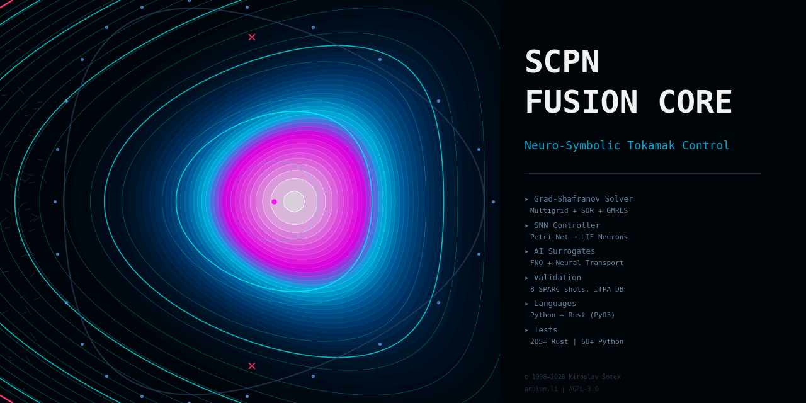

# SCPN Fusion Core

**Full-stack neuro-symbolic tokamak control and physics simulation — 234 Python modules, 11 Rust crates, 62K lines of physics — with 0.52 us kernel latency, native gyrokinetic eigenvalue solver, and zero-disruption stress-test results.**

<p align="center">
  
</p>

[](https://github.com/anulum/scpn-fusion-core/actions/workflows/ci.yml) [](https://github.com/anulum/scpn-fusion-core/actions/workflows/docs.yml) [](https://codecov.io/gh/anulum/scpn-fusion-core) [](https://anulum.github.io/scpn-fusion-core/) [](https://pypi.org/project/scpn-fusion/) [](https://doi.org/10.5281/zenodo.18820864) [](LICENSE)     [](https://scorecard.dev/viewer/?uri=github.com/anulum/scpn-fusion-core) [](https://www.bestpractices.dev/projects/12163)

Most fusion codes are physics-first — solve equations, then bolt on control.
SCPN Fusion Core inverts this: **control-first**. Express plasma control logic
as stochastic Petri nets, compile to spiking neural networks, execute at
**10 kHz+** against physics-informed plant models. Pure Python with optional
Rust acceleration (6,600x speedup).

> **Minimal control-only package:** [`scpn-control`](https://github.com/anulum/scpn-control) (98 modules, pip-installable).
> This repo is the full physics + research suite.

## What Is It?

| Layer | Modules | Capability |
|-------|---------|-----------|
| **Core Physics** | 118 | Grad-Shafranov, transport (1.5D + QLKNN + FNO), GK three-path (native + 5 external codes), MHD stability (7 criteria), neoclassical, disruption chain, ELM/MARFE/L-H transition, runaway electrons, pellet injection, plasma-wall interaction, 3D equilibrium |
| **Control** | 54 | PID, H-infinity, NMPC-JAX, SNN (Petri net compiler), gain-scheduled, fault-tolerant, safe RL (PPO), free-boundary tracking, burn control, RZIP, RWM feedback, mu-synthesis, detachment, density, volt-second management, state estimation (EKF) |
| **Phase Dynamics** | 10 | Kuramoto UPDE solver, adaptive K_nm coupling, GK-to-UPDE bridge, plasma K_nm, Lyapunov guard, real-time monitoring, WebSocket streaming |
| **Diagnostics** | 5 | Synthetic sensors, tomographic inversion, forward models |
| **Engineering** | 4 | Balance of plant, CAD raytrace, thermal hydraulics |
| **Nuclear** | 5 | Blanket neutronics, PWI erosion, wall interaction |
| **SCPN Compiler** | 12 | Petri net structure, compiler, contracts, safety interlocks, artifact packaging |
| **I/O** | 15 | IMAS/OMAS adapter, GEQDSK, tokamak archive, logging |
| **Rust Backend** | 11 crates | GS kernel (0.52 us), transport, control, ML inference, PyO3 bindings |

**Total: 234 Python source files | 62,570 lines | 2,859 tests | 74 validation scripts | 11 Rust crates**

## Try in 45 Seconds

```bash
pip install -e .
scpn-fusion kernel          # Grad-Shafranov equilibrium
scpn-fusion flight          # Tokamak flight simulator
pytest tests/ -x -q          # 2,859 tests
```

```bash
python examples/minimal.py --grid 17 --equilibrium-iters 4
```

Or run the **Golden Base** hero notebook — formal proofs, closed-loop control,
shot replay, all in one:
[`examples/neuro_symbolic_control_demo_v2.ipynb`](examples/neuro_symbolic_control_demo_v2.ipynb)
[](https://colab.research.google.com/github/anulum/scpn-fusion-core/blob/main/examples/neuro_symbolic_control_demo_v2.ipynb)
[](https://mybinder.org/v2/gh/anulum/scpn-fusion-core/main?labpath=examples%2Fneuro_symbolic_control_demo_v2.ipynb)

```bash
docker compose up --build    # Streamlit dashboard at localhost:8501
```

## Key Results

| Metric | Value | Reproducibility |
|--------|-------|-----------------|
| Rust PID kernel latency | **0.52 us P50** | `validation/verify_10khz_rust.py` |
| Closed-loop HIL latency | **10.5 us P50** | `python validation/collect_results.py` |
| QLKNN-10D transport surrogate | test rel_L2 = **0.094** | `weights/neural_transport_qlknn.metrics.json` |
| FNO turbulence surrogate | val rel_L2 = **0.055** | `weights/fno_turbulence_jax.metrics.json` |
| Disruption rate (1,000-shot sim campaign) | **0%** (Rust-PID) | `validation/stress_test_campaign.py` |
| ITPA H-mode confinement | 53 shots / 24 machines | `validation/reference_data/itpa/` |
| SPARC GEQDSK validation | 8 EFIT equilibria (MIT, CFS) | `validation/reference_data/sparc/` |
| Q >= 10 operating point | Q = 15 (0D power balance) | `RESULTS.md` |
| TBR | 1.14 (0D 3-group blanket) | `RESULTS.md` |
| FreeGS equilibrium parity | **FAIL** (psi NRMSE 1.80) | `validation/benchmark_vs_freegs.py` |

Latency taxonomy: `control.pid_kernel_step_us` (0.52 us P50), `control.closed_loop_step_us` (23.8 us P50 / 122 us P99), `control.hil_loop_us` (10.5 us P50). Full definitions: [`docs/PERFORMANCE_METRIC_TAXONOMY.md`](docs/PERFORMANCE_METRIC_TAXONOMY.md).

Full numbers: [`RESULTS.md`](RESULTS.md) — re-run `python validation/collect_results.py` to reproduce.

## Gyrokinetic Three-Path Architecture

No other fusion code offers all three gyrokinetic transport tiers in one framework:

| Path | Fidelity | Speed | Module |
|------|----------|-------|--------|
| **A: External GK** | Reference | minutes | `gk_tglf`, `gk_gene`, `gk_gs2`, `gk_cgyro`, `gk_qualikiz` |
| **B: Native Linear GK** | High | ~0.3 s/surface | `gk_eigenvalue` + `gk_quasilinear` (Miller geometry, Sugama collisions) |
| **C: Hybrid Surrogate+GK** | Adaptive | ~24 ns/point | `gk_ood_detector` + `gk_corrector` + `gk_scheduler` + `gk_online_learner` |

The hybrid layer validates QLKNN surrogates against GK spot-checks in real time, triggering full GK solves only when the surrogate is out-of-distribution.

## Honest Scope

This is **not** a replacement for TRANSP, JINTRAC, or GENE. It is a
**control-algorithm development framework** with reduced-order physics models
fast enough for real-time loop closure. See
[`docs/HONEST_SCOPE.md`](docs/HONEST_SCOPE.md) for the full limitations
assessment, and [`docs/CLAIMS_EVIDENCE_MAP.md`](docs/CLAIMS_EVIDENCE_MAP.md)
for every claim mapped to its evidence artifact.

Top limitations:
- No full 5D gyrokinetic turbulence solve in-loop (native linear GK + surrogate + reduced-order).
- No full 3D nonlinear MHD stack in-loop (external coupling required for that fidelity).
- Free-boundary equilibrium/inverse reconstruction is not yet EFIT-grade.

## Competitive Position

| Capability | SCPN Fusion Core | TORAX | FUSE | FreeGS | DREAM |
|-----------|:---:|:---:|:---:|:---:|:---:|
| Free-boundary GS solve | **Y** | N | N | Y | N |
| 1.5D coupled transport | **Y** | Y | Y | N | N |
| Neural transport surrogate | **Y** (QLKNN-10D) | N | N | N | N |
| Native GK eigenvalue solver | **Y** | N | N | N | N |
| External GK coupling (5 codes) | **Y** | TGLF only | TGLF only | N | N |
| Neuro-symbolic SNN compiler | **Y** | N | N | N | N |
| Real-time control (<1 us) | **Y** (0.52 us Rust) | N | N | N | N |
| H-infinity robust control | **Y** | N | N | N | N |
| Free-boundary tracking | **Y** (direct kernel + supervisor) | N | N | N | N |
| Disruption chain (TQ+CQ+RE+halo) | **Y** | N | N | N | Y |
| ELM model + RMP suppression | **Y** | N | Y | N | N |
| Runaway electron dynamics | **Y** | N | N | N | Y |
| Pellet injection (Parks-Turnbull) | **Y** | N | N | N | N |
| Impurity transport (neoclassical) | **Y** | N | N | N | N |
| Momentum transport (ExB shearing) | **Y** | N | partial | N | N |
| MHD stability (7 criteria) | **Y** | N | N | N | N |
| Digital twin + HIL testing | **Y** | N | N | N | N |
| Deterministic replay | **Y** | N | N | N | N |
| SCPN phase dynamics (Kuramoto/UPDE) | **Y** | N | N | N | N |
| JAX autodiff transport | **Y** | Y | N | N | N |

Full analysis: [`docs/competitive_analysis.md`](docs/competitive_analysis.md)

## Core Innovation: Neuro-Symbolic Compiler

```
Petri Net (places + transitions + contracts)
    |
    v  compiler.py -- structure-preserving mapping
Stochastic LIF Network (neurons + synapses + thresholds)
    |
    v  controller.py -- closed-loop execution
Real-Time Plasma Control (sub-ms latency, deterministic replay)
    |
    v  artifact.py -- versioned, signed compilation artifact
Deployment Package (JSON + schema version + git SHA)
```

Control logic is the primary artifact — expressed in a formally verifiable
Petri net formalism, compiled to spiking neural networks, executed at
hardware-compatible latencies. The physics modules provide a realistic plant
model for the controller to operate against.

| Property | How |
|----------|-----|
| Formal verification | Contract checking preserves Petri net invariants (boundedness, liveness, reachability) |
| Hardware targeting | Same Petri net compiles to NumPy, SC-NeuroCore (FPGA), or neuromorphic silicon |
| Graceful degradation | Every path has a pure-Python fallback |
| Deterministic replay | Identical inputs produce identical outputs across platforms |

## Controller Stress-Test Campaign (1,000 shots)

| Controller | P50 Latency | P95 Latency | Disruption Rate |
|-----------|------------|------------|-----------------|
| **Rust-PID** | **0.52 us** | 0.67 us | **0%** |
| PID (Python) | 3,431 us | 3,624 us | 0% |
| H-infinity | 3,227 us | 3,607 us | 100% |
| NMPC-JAX | 45,450 us | 49,773 us | 0% |
| Nengo-SNN | 23,573 us | 24,736 us | 0% |

H-infinity is a research lane (reduced-order 2x2 robust model) and is not
part of production release acceptance criteria.

---

<details>
<summary><strong>Architecture (234 modules)</strong></summary>

```
scpn-fusion-core/
+-- src/scpn_fusion/              # Python package (234 source files)
|   +-- core/           (118)    # Plasma physics: GS, transport, GK, MHD, disruptions
|   +-- control/         (54)    # Controllers: PID, H-inf, NMPC, SNN, RL, free-boundary
|   +-- phase/           (10)    # SCPN dynamics: Kuramoto, UPDE, adaptive K_nm
|   +-- scpn/            (12)    # Neuro-symbolic compiler, contracts, interlocks
|   +-- io/              (15)    # IMAS, GEQDSK, archive, logging
|   +-- diagnostics/      (5)    # Synthetic sensors, tomography
|   +-- nuclear/           (5)    # Blanket neutronics, PWI, erosion
|   +-- engineering/       (4)    # Balance of plant, thermal hydraulics
|   +-- hpc/               (2)    # HPC bridge, C library interface
|   +-- ui/                (4)    # Streamlit dashboard
+-- scpn-fusion-rs/               # Rust workspace (11 crates)
|   +-- crates/
|       +-- fusion-types/         # Shared data types
|       +-- fusion-math/          # Linear algebra, FFT
|       +-- fusion-core/          # Grad-Shafranov, transport
|       +-- fusion-physics/       # MHD, heating, turbulence
|       +-- fusion-control/       # PID, MPC, disruption
|       +-- fusion-ml/            # Inference engine
|       +-- fusion-python/        # PyO3 bindings
+-- tests/               (334)    # 2,859 test functions (Hypothesis property tests)
+-- validation/           (74)    # Benchmark pipeline + reference data
+-- examples/             (16)    # 10 Jupyter notebooks + 6 scripts
```

</details>

<details>
<summary><strong>Installation</strong></summary>

### Python (no Rust required)

```bash
pip install -e .                      # core runtime (minimal deps)
pip install "scpn-fusion[full]"       # core + UI + JAX/ML + RL + physics extras
pip install "scpn-fusion[ui,ml,rl]"   # explicit optional stacks only
```

Every module auto-detects Rust and falls back to NumPy/SciPy.

### Rust acceleration (optional)

```bash
pip install "scpn-fusion[rust]"
cd scpn-fusion-rs
cargo build --release && cargo test
cd crates/fusion-python && maturin develop --release
```

### Docker

```bash
docker compose up --build                              # dashboard
docker build --build-arg INSTALL_DEV=1 -t dev .        # with tests
docker run dev pytest tests/ -v
```

### Testing

```bash
pip install -e ".[dev]"
pytest tests/ -v                 # Python (Hypothesis property tests)
cd scpn-fusion-rs && cargo test  # Rust (proptest)
cargo bench                      # Criterion benchmarks
```

</details>

<details>
<summary><strong>Physics Modules (118 core)</strong></summary>

### Equilibrium & Stability
| Module | Physics |
|--------|---------|
| `fusion_kernel` | Nonlinear free-boundary Grad-Shafranov (Newton/Picard/SOR/multigrid) |
| `jax_gs_solver` | JAX-differentiable GS solver (Picard + damped Jacobi) |
| `force_balance` | Force balance verification (J x B = grad p) |
| `stability_mhd` | 7-criterion suite: Mercier, ballooning, K-S, Troyon, NTM, RWM, peeling-ballooning |
| `ballooning_solver` | Full ideal MHD ballooning equation solver |
| `elm_model` | Peeling-ballooning boundary + Chirikov overlap + RMP suppression |

### Transport
| Module | Physics |
|--------|---------|
| `integrated_transport_solver` | 1.5D coupled (Te, Ti, ne, current diffusion) |
| `jax_solvers` | JAX Thomas + Crank-Nicolson (differentiable, batched via vmap) |
| `neural_transport` | QLKNN-10D surrogate (test rel_L2=0.094) |
| `momentum_transport` | NBI torque, ExB shearing (Waltz 1994), rotation solver |
| `neoclassical` | Chang-Hinton chi + Sauter bootstrap current |
| `impurity_transport` | Hirshman & Sigmar neoclassical pinch (multi-species) |

### Gyrokinetic Three-Path
| Module | Physics |
|--------|---------|
| `gk_eigenvalue` | Native linear GK solver (ballooning, Sugama collisions) |
| `gk_quasilinear` | Mixing-length saturation -> chi_i, chi_e, D_e |
| `gyrokinetic_transport` | TGLF-10 input, ITG/TEM/ETG mode identification |
| `gk_tglf` / `gk_gene` / `gk_gs2` / `gk_cgyro` / `gk_qualikiz` | 5 external GK solver interfaces |
| `gk_ood_detector` + `gk_corrector` + `gk_scheduler` | Hybrid surrogate validation |

### Disruption & Edge Physics
| Module | Physics |
|--------|---------|
| `disruption_sequence` | Full chain: thermal quench -> current quench -> RE -> halo currents |
| `runaway_electrons` | Connor & Hastie primary + Rosenbluth & Putvinski avalanche + Smith hot-tail |
| `pellet_injection` | Parks & Turnbull 1978 NGS ablation + drift displacement |
| `plasma_wall_interaction` | Eckstein sputtering + 1D wall thermal + Coffin-Manson fatigue |
| `marfe` | Radiation condensation + density limit |
| `lh_transition` | Zonal flow predator-prey L-H transition |
| `locked_mode` | Error field amplification -> rotation braking -> mode locking |
| `plasma_startup` | Paschen breakdown -> Townsend avalanche -> burn-through |
| `blob_transport` | SOL filament propagation + cross-field diffusion |

### Advanced
| Module | Physics |
|--------|---------|
| `alfven_eigenmodes` | TAE/RSAE continuum + fast-particle drive |
| `tearing_mode_coupling` | Multi-mode nonlinear interaction + disruption triggering |
| `orbit_following` | Alpha particle guiding-center orbits + confinement time |
| `vmec_lite` | 3D fixed-boundary MHD equilibrium (Fourier harmonics) |
| `neural_turbulence` | QLKNN-class 10-parameter MLP surrogate |
| `vessel_model` | Vacuum vessel eddy currents (lumped circuit) |
| `kinetic_efit` | Anisotropic fast-ion pressure reconstruction |
| `integrated_scenario` | Full coupled scenario (current diffusion + transport + NTM + SOL) |

</details>

<details>
<summary><strong>Control Modules (54)</strong></summary>

| Category | Modules |
|----------|---------|
| **Classical** | PID (Rust 0.52 us), H-infinity (Riccati synthesis), gain-scheduled, sliding-mode vertical |
| **Optimal** | NMPC-JAX (SQP), MPC (gradient trajectory), optimal control |
| **Learning** | Safe RL (Lagrangian PPO), PPO 500K (beats MPC+PID), controller tuning (Bayesian) |
| **Neuro-symbolic** | SNN compiler, cybernetic controller, Nengo SNN wrapper |
| **Disruption** | Predictor (ML), SPI mitigation, checkpoint policy, disruption contracts |
| **Free-boundary** | Direct kernel tracking + supervisor rejection + EKF latency compensation |
| **Burn & Fueling** | Burn controller (alpha heating), pellet fueling, density control, detachment |
| **Stability** | RWM feedback, mu-synthesis (D-K iteration), RZIP model |
| **Infrastructure** | State estimator (EKF), volt-second manager, scenario scheduler, fault-tolerant control |
| **Simulation** | Digital twin, flight simulator (Python + Rust), Gymnasium environment |
| **Integration** | Director interface, bio-holonomic controller (SCPN L4/L5 bridge) |

</details>

<details>
<summary><strong>Tutorial Notebooks</strong></summary>

| Notebook | Description |
|----------|-------------|
| **`neuro_symbolic_control_demo_v2`** | **Golden Base v2** — formal proofs + closed-loop + replay |
| `01_compact_reactor_search` | MVR-0.96 compact reactor optimizer |
| `02_neuro_symbolic_compiler` | Petri net -> SNN compilation pipeline |
| `03_grad_shafranov_equilibrium` | Free-boundary equilibrium solver |
| `04_divertor_and_neutronics` | Divertor heat flux & TBR |
| `05_validation_against_experiments` | Cross-validation vs SPARC & ITPA |
| `06_inverse_and_transport_benchmarks` | Inverse solver & neural transport |
| `07_multi_ion_transport` | Multi-species transport evolution |
| `08_mhd_stability` | Ballooning & Mercier criteria |
| `09_coil_optimization` | Coil current optimization (Tikhonov) |
| `10_uncertainty_quantification` | Monte Carlo UQ chain |

</details>

<details>
<summary><strong>Validation Data</strong></summary>

| Dataset | Source | Contents |
|---------|--------|----------|
| **SPARC GEQDSK** | [SPARCPublic](https://github.com/cfs-energy/SPARCPublic) (MIT) | 8 EFIT equilibria (B=12.2 T, Ip up to 8.7 MA) |
| **ITPA H-mode** | Verdoolaege et al., NF 61 (2021) | 53 shots from 24 machines |
| **DIII-D disruptions** | Reference profiles (16 shots) | Locked mode, VDE, tearing, density, beta |
| **Multi-machine GEQDSK** | Synthetic Solov'ev | 100 equilibria (DIII-D, JET, EAST, KSTAR, ASDEX-U) |

```bash
python validation/validate_real_shots.py        # real-shot gate
python validation/collect_results.py            # full 15-lane benchmark
python validation/benchmark_gk_linear.py        # GK eigenvalue benchmark
```

</details>

<details>
<summary><strong>Benchmarks & Solver Performance</strong></summary>

All numbers are internal measurements. Reproduce with `cargo bench` and
`python validation/collect_results.py`.

| Metric | Value | Source |
|--------|-------|--------|
| SOR step @ 65x65 | us-range | `sor_bench.rs` |
| GMRES(30) @ 65x65 | ~45 iters | `gmres_bench.rs` |
| Multigrid V(3,3) @ 129x129 | ~10 cycles | `multigrid_bench.rs` |
| Rust flight sim | 0.3 us/step | `verify_10khz_rust.py` |
| Full equilibrium (Python) | ~5 s | `profile_kernel.py` |
| Neural transport MLP | ~5 us/point | `neural_transport_bench.rs` |
| JAX GS solve (33x33) | ~50 ms | `jax_gs_solver.py` |
| Native GK eigenvalue | ~0.3 s/surface | `gk_eigenvalue.py` |
| QLKNN single-point | ~24 ns | `neural_transport.py` |

### Community context (not direct comparisons)

| Code | Category | Typical Runtime |
|------|----------|-----------------|
| GENE | 5D gyrokinetic | ~10^6 CPU-h |
| JINTRAC | Integrated modelling | ~10 min/shot |
| TORAX | Integrated (JAX) | ~30 s (GPU) |
| DREAM | Disruption / runaway | ~1 s |

</details>

<details>
<summary><strong>Code Health & Hardening</strong></summary>

263 hardening tasks across 8 waves (S2-S4, H5-H8). Every production-path
module returns structured errors.

| Metric | Value |
|--------|-------|
| Python source files | 234 |
| Python lines of code | 62,570 |
| Test functions | 2,859 |
| Validation scripts | 74 |
| Rust crates | 11 |
| CI jobs | 24 |
| Underdeveloped entries | 115 (tracked, auto-regenerated) |

Audit artifacts:
- [Underdeveloped register](UNDERDEVELOPED_REGISTER.md)
- [Claims evidence map](docs/CLAIMS_EVIDENCE_MAP.md)
- [Validation gate matrix](docs/VALIDATION_GATE_MATRIX.md)
- [Release acceptance checklist](docs/RELEASE_ACCEPTANCE_CHECKLIST.md)
- [Honest scope](docs/HONEST_SCOPE.md)
- [Competitive analysis](docs/competitive_analysis.md)

</details>

## Community

- [Discussions](https://github.com/anulum/scpn-fusion-core/discussions) — Q&A, ideas, show and tell
- [Roadmap](ROADMAP.md) — v4.0 targets and beyond
- [Contributing](CONTRIBUTING.md) — how to get started

## Citation

```bibtex
@software{scpn_fusion_core,
  title   = {SCPN Fusion Core: Neuro-Symbolic Tokamak Control Suite},
  author  = {Sotek, Miroslav},
  year    = {2026},
  url     = {https://github.com/anulum/scpn-fusion-core},
  version = {3.9.3}
}
```

## Author

- **Miroslav Sotek** — ANULUM CH & LI — [ORCID](https://orcid.org/0009-0009-3560-0851)

## License

GNU Affero General Public License v3.0 — see [LICENSE](LICENSE).
Commercial licensing: protoscience@anulum.li
