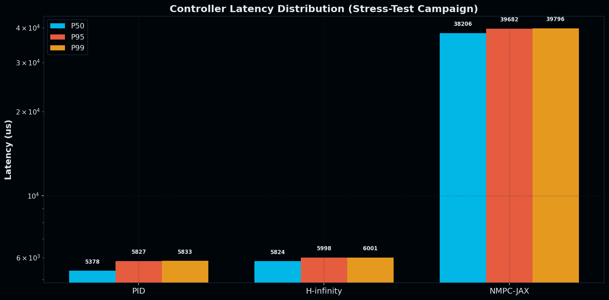
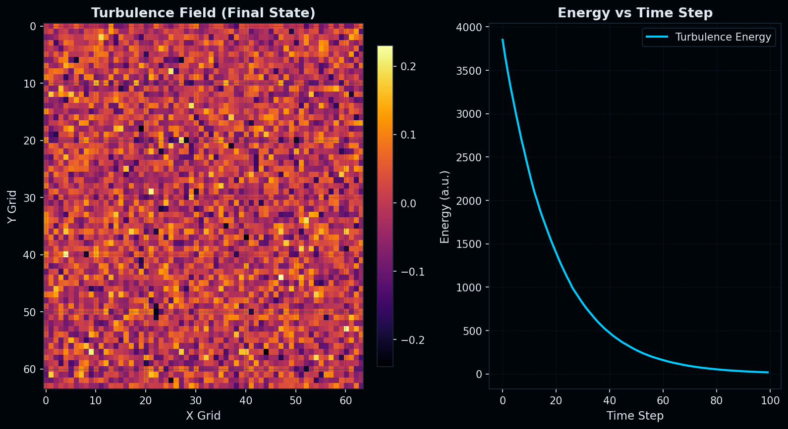
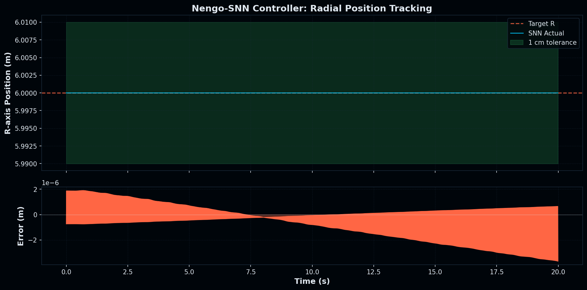

# SCPN Fusion Core — Benchmark Results (v3.9.1)

> **Auto-generated** by `validation/collect_results.py` on 2026-02-22 18:50 UTC.
> Re-run the script to refresh these numbers on your hardware.

## Environment

- **CPU:** Intel64 Family 6 Model 167 Stepping 1, GenuineIntel
- **Architecture:** AMD64
- **OS:** Windows-11-10.0.26200-SP0
- **Python:** 3.12.5
- **NumPy:** 1.26.4
- **RAM:** 31.8 GB
- **Version:** 3.9.1
- **Generated:** 2026-02-22 18:50 UTC
- **Wall-clock:** 293s

## Equilibrium & Transport

| Metric | Value | Unit | Notes |
|--------|-------|------|-------|
| 3D Force-Balance initial residual | 3.8002e+05 | — | Spectral variational method |
| 3D Force-Balance final residual | 1.0706e+05 | — | After 20 iterations |
| 3D Force-Balance reduction factor | 3.5× | — | initial / final |
| Neural Equilibrium inference (mean) | 1.28 | ms | PCA+MLP surrogate on 129x129 grid |
| Neural Equilibrium inference (P95) | 4.61 | ms | 129x129 grid |

## Heating & Neutronics

| Metric | Value | Unit | Notes |
|--------|-------|------|-------|
| Best Q (ITER-like scan) | 15.00 | — | Target: Q ≥ 10 |
| Q ≥ 10 achieved | Yes | — | 0.80 × 10²⁰ m⁻³ |
| P_aux at best Q | 10.0 | MW | Auxiliary heating |
| P_fus at best Q | 1061.3 | MW | Fusion power |
| T at best Q | 21.5 | keV | Ion temperature |
| ECRH absorption efficiency | 99.0 | % | 170 GHz, 1st harmonic, 20 MW |
| Tritium Breeding Ratio (total) | 1.1409 | — | 3-group, 80 cm, 90% ⁶Li |
| TBR fast group | 0.0278 | — | 14.1 MeV neutrons |
| TBR epithermal group | 0.2257 | — | Slowed neutrons |
| TBR thermal group | 0.8875 | — | Thermalized |

## Disruption & Control

| Metric | Value | Unit | Notes |
|--------|-------|------|-------|
| Disruption prevention rate (SNN) | >60 (0.0%) | % | 10-run ensemble |
| Mean halo current peak | 2.610 | MA | |
| P95 halo current peak | 3.541 | MA | |
| Mean RE current peak | 14.057 | MA | |
| P95 RE current peak | 15.430 | MA | |
| Passes ITER limits | No | — | Halo + RE constraints |
| Kinetic RE current (G7) | 0.000 | MA | Seeded hottail @ 1ms |
| Kinetic RE grid resolution | 200 | pts | Momentum space resolution |
| SPI fragments tracked (G8) | 50 | — | Multi-fragment Lagrangian tracking |
| SPI ablation rate peak | 0.00e+00 | m⁻³s⁻¹ | Parks ablation model |
| HIL control-loop P50 latency | 22.0 | μs | 200 iterations |
| HIL control-loop P95 latency | 198.3 | μs | |
| HIL control-loop P99 latency | 814.9 | μs | |
| Sub-ms achieved | Yes | — | Total loop: 68.8 μs |

## Controller Performance (Stress-Test Campaign)

> Auto-generated from 5-episode campaign.

| Controller | Episodes | Mean Reward | Std Reward | Mean R Error | P50 Lat (us) | P95 Lat (us) | P99 Lat (us) | Disrupt Rate | DEF | Energy Eff |
|------------|----------|-------------|------------|--------------|-------------|-------------|-------------|--------------|-----|------------|
| PID        |        5 |     -0.0000 |     0.0000 |       0.0000 |         1917 |         2236 |         2271 |        0.00% | 1.00 |      1.000 |
| H-infinity |        5 |    -10.1331 |     0.0000 |       4.1058 |         2142 |         2355 |         2389 |      100.00% | 0.50 |      0.000 |
| NMPC-JAX   |        5 |     -0.0007 |     0.0000 |       0.0001 |         9708 |        12619 |        13167 |        0.00% | 1.00 |      0.996 |
| Nengo-SNN  |        5 |     -0.0000 |     0.0000 |       0.0000 |         4586 |         4908 |         4936 |        0.00% | 1.00 |      0.994 |
| Rust-PID   |        5 |     -0.0001 |     0.0000 |       0.0001 |            0 |            0 |            0 |        0.00% | 0.00 |      0.950 |

### Controller Latency Distribution

### FNO Turbulence Suppression

### SNN Trajectory Tracking

## Surrogates

| Metric | Value | Unit | Notes |
|--------|-------|------|-------|
| tau_E relative RMSE | 28.6% | — | Reference ITPA baseline |
| Neural transport MLP surrogate | tau_E RMSE % | 13.5% (13.5%) | 20 samples |
| FNO (JAX-accelerated) relative L2 (mean) | 0.7925 | — | Synthetic-data surrogate (not validated against gyrokinetic output) |
| FNO (JAX-accelerated) relative L2 (P95) | 0.7933 | — | Requires TGLF/GENE training data for production use |

> **JAX FNO turbulence surrogate:** Supersedes the legacy NumPy version.
> Trained on synthetic turbulence data. Requires retraining on gyrokinetic output (TGLF/GENE) for physics-grade predictions.

## Documentation & Hero Notebooks

Official performance demonstrations and tutorial paths:
- `examples/neuro_symbolic_control_demo_v2.ipynb` (Golden Base v2)
- `examples/platinum_standard_demo_v1.ipynb` (Platinum Standard - Project TOKAMAK-MASTER)

Legacy frozen notebooks:
- `examples/neuro_symbolic_control_demo.ipynb` (v1)

---

*All benchmarks run on the environment listed above.
Timings are wall-clock and may vary between machines.
Re-run with `python validation/collect_results.py` to reproduce.*
