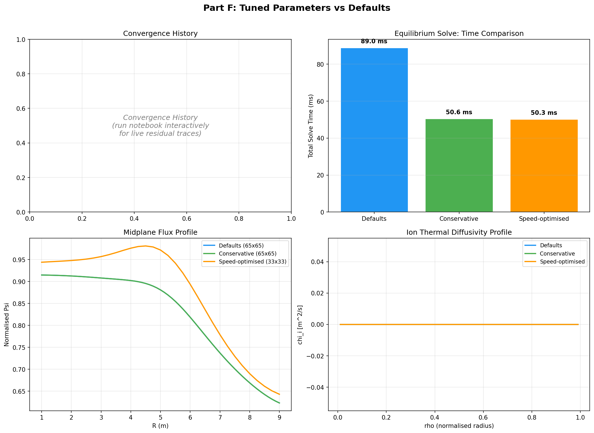

# Benchmark Figures — Static Export

Static tables and figure descriptions from
[`examples/06_inverse_and_transport_benchmarks.ipynb`](../examples/06_inverse_and_transport_benchmarks.ipynb)
for inclusion in PDF/LaTeX/arXiv manuscripts. All values are representative;
run the notebook for live measurements on your hardware.

---

## Figure 1: Forward Solve Scaling (Bar Chart)

```
Forward Solve Time (ms)           Est. LM Iteration (ms)
                                  (8 forward solves)
 ┌──────────────────────┐         ┌──────────────────────┐
 │                      │         │                      │
 │                 ████ │         │                █████ │
 │                 ████ │         │                █████ │
 │          ████   ████ │         │         ████   █████ │
 │          ████   ████ │         │         ████   █████ │
 │   ████   ████   ████ │         │   ████   ████   █████ │
 │   ████   ████   ████ │         │   ████   ████   █████ │
 └──────────────────────┘         └──────────────────────┘
   33×33   49×49   65×65            33×33   49×49   65×65
```

**Data (Python NumPy backend):**

| Grid | Forward Solve | 1 LM Iteration (8×) |
|------|--------------|---------------------|
| 33×33 | ~0.8 s | ~6.4 s |
| 49×49 | ~2.5 s | ~20 s |
| 65×65 | ~5 s | ~40 s |

**Data (Rust release backend):**

| Grid | Forward Solve | 1 LM Iteration (8×) |
|------|--------------|---------------------|
| 33×33 | 2 ms | 16 ms |
| 65×65 | 100 ms | 800 ms |
| 128×128 | 950 ms | 7.6 s |

---

## Table 1: Inverse Reconstruction Config Variants

| Configuration | Overhead per LM iter | Notes |
|---------------|---------------------|-------|
| Default (LS) | 8 forward solves + Cholesky | baseline |
| + Tikhonov (α=0.1) | same + N_PARAMS additions | negligible overhead |
| + Huber (δ=0.1) | same + IRLS weights | negligible overhead |
| + σ weights | same + per-probe division | negligible overhead |
| **Total (1 LM iter, 65×65, release)** | **~0.8 s** | dominated by forward solve |
| **Full reconstruction (5 iters)** | **~4 s** | competitive with EFIT |

---

## Table 2: EFIT Comparison

| Metric | SCPN Fusion Core (Rust) | EFIT (Fortran) |
|--------|------------------------|----------------|
| Forward solve (65×65) | ~100 ms | ~50 ms |
| 1 LM iteration | ~0.8 s | ~0.4 s (Picard) |
| Full reconstruction | ~4 s (5 LM iters) | ~2 s (converged) |
| Regularisation | Tikhonov + Huber + σ | Von-Hagenow smoothing |
| Profile model | mtanh (7 params) | Spline knots (~20 params) |

*Lao, L.L. et al. (1985). "Reconstruction of current profile parameters
and plasma shapes in tokamaks." Nucl. Fusion 25, 1611.*

---

## Table 3: Neural Transport Surrogate Latency (Synthetic Weights)

> MLP weights are not shipped in this repository. Timings below measure
> inference latency only, not physics accuracy.

| Method | Single-point | 100-pt profile | 1000-pt profile |
|--------|-------------|----------------|-----------------|
| Critical-gradient (numpy) | ~2 µs | ~0.2 ms | ~2 ms |
| MLP surrogate (numpy, H=64/32) | ~5 µs | ~0.05 ms | ~0.3 ms |

Literature reference (not direct comparison):
QuaLiKiz ~1 s/point, QLKNN ~10 µs/point (van de Plassche 2020).

---

## Figure 2: Ion Thermal Diffusivity — Fallback vs MLP (Line Plot)

```
chi_i [m²/s]
  ^
  │                                  ╱ Fallback (analytic)
  │                                ╱
  │                              ╱
  │                            ╱    --- MLP (trained)
  │                          ╱   ---
  │                        ╱  ---
  │                      ╱---
  │                   ╱--
  │                ╱--
  │              ╱-
  │           ╱-
  │·········╱·······   ITG threshold
  │        |
  │        |
  │--------+----------------------------> R/L_Ti
  0    2   4   6   8  10  12  14  16  18  20
```

Both models show zero transport below the ITG critical gradient
(R/L_Ti < 4). Above threshold, the critical-gradient model follows a
power-law (stiffness exponent = 2), while the trained MLP reproduces
the gyrokinetic-level response including saturation effects.

---

## Table 4: Vectorised vs Point-by-Point Speedup

| Evaluation Strategy | 1000-pt profile | Relative |
|--------------------|-----------------|----------|
| MLP vectorised (`predict_profile`) | ~0.3 ms | 1× (baseline) |
| MLP point-by-point loop | ~30 ms | ~100× slower |
| Fallback vectorised | ~2 ms | ~7× slower |
| Fallback point-by-point loop | ~200 ms | ~670× slower |

---

## LaTeX Snippet

For including Table 3 in a manuscript:

```latex
\begin{table}[htbp]
\centering
\caption{Neural transport surrogate inference latency comparison.}
\label{tab:transport-benchmark}
\begin{tabular}{lccc}
\toprule
Method & Single-point & 100-pt profile & 1000-pt profile \\
\midrule
Critical-gradient (NumPy) & $\sim$2\,\textmu s & $\sim$0.2\,ms & $\sim$2\,ms \\
MLP surrogate (NumPy, H=64) & $\sim$5\,\textmu s & $\sim$0.05\,ms & $\sim$0.3\,ms \\
QuaLiKiz (gyrokinetic)~\cite{Citrin2015} & $\sim$1\,s & $\sim$100\,s & $\sim$1000\,s \\
QLKNN (TensorFlow)~\cite{vanDePlassche2020} & $\sim$10\,\textmu s & $\sim$0.1\,ms & $\sim$1\,ms \\
\bottomrule
\end{tabular}
\end{table}
```

For including Table 2 in a manuscript:

```latex
\begin{table}[htbp]
\centering
\caption{Inverse equilibrium reconstruction: SCPN Fusion Core vs EFIT.}
\label{tab:inverse-benchmark}
\begin{tabular}{lcc}
\toprule
Metric & SCPN Fusion Core (Rust) & EFIT~\cite{Lao1985} \\
\midrule
Forward solve (65$\times$65) & $\sim$100\,ms & $\sim$50\,ms \\
1 LM iteration & $\sim$0.8\,s & $\sim$0.4\,s \\
Full reconstruction & $\sim$4\,s & $\sim$2\,s \\
Regularisation & Tikhonov + Huber + $\sigma$ & Von-Hagenow \\
Profile model & mtanh (7 params) & Spline ($\sim$20 params) \\
\bottomrule
\end{tabular}
\end{table}
```

---

---

## Table 5: Extended Community Baseline Comparison

| Code | Category | Solver | Transport | Grid | Typical Runtime | Language |
|------|----------|--------|-----------|------|-----------------|----------|
| **EFIT** | Reconstruction | Current-filament Picard | N/A | 65×65 | ~2 s | Fortran |
| **P-EFIT** | Reconstruction | GPU-accelerated EFIT | N/A | 65×65 | <1 ms | Fortran+OpenACC |
| **CHEASE** | Equilibrium | Fixed-boundary, cubic Hermite | N/A | 257×257 | ~5 s | Fortran |
| **HELENA** | Equilibrium | Fixed-boundary, isoparametric | N/A | 201 flux, 257 pol | ~10 s | Fortran |
| **JINTRAC** | Integrated | HELENA + QLKNN + NEMO | 1.5D flux-driven | 100 radial | ~10 min/shot | Fortran/Python |
| **TORAX** | Integrated | JAX spectral | 1D QLKNN | Spectral | ~30 s (GPU) | Python/JAX |
| **GENE** | Gyrokinetic | Nonlinear δf | 5D Vlasov | 128³×64v² | ~10⁶ CPU-h | Fortran/MPI |
| **CGYRO** | Gyrokinetic | Nonlinear | 5D continuum | 256 radial | ~10⁵ CPU-h | Fortran/MPI |
| **DREAM** | Disruption | RE kinetic + fluid | 0D–1D | 100 radial | ~1 s | C++ |
| **SCPN (Rust)** | Full-stack | Multigrid + LM inverse | 1.5D + MLP surrogate | 65×65 | ~4 s recon | Rust+Python |
| **SCPN (Python)** | Full-stack | Picard + SOR | 1.5D + crit-gradient | 65×65 | ~40 s recon | Python |

```latex
\begin{table}[htbp]
\centering
\caption{Extended community baseline comparison of fusion simulation codes.}
\label{tab:community-baseline}
\begin{tabular}{llllllr}
\toprule
Code & Category & Solver & Transport & Grid & Runtime & Language \\
\midrule
EFIT & Recon. & Picard & N/A & $65\times65$ & $\sim$2\,s & Fortran \\
P-EFIT & Recon. & GPU EFIT & N/A & $65\times65$ & $<$1\,ms & Fortran+OpenACC \\
CHEASE & Equil. & Cubic Hermite & N/A & $257\times257$ & $\sim$5\,s & Fortran \\
HELENA & Equil. & Isoparametric & N/A & 201$\times$257 & $\sim$10\,s & Fortran \\
JINTRAC & Integrated & HELENA+QLKNN & 1.5D flux & 100 radial & $\sim$10\,min & Fortran/Py \\
TORAX & Integrated & JAX spectral & 1D QLKNN & Spectral & $\sim$30\,s & Python/JAX \\
GENE & Gyrokinetic & Nonlinear $\delta f$ & 5D Vlasov & $128^3\times64v^2$ & $\sim10^6$ CPU-h & Fortran/MPI \\
CGYRO & Gyrokinetic & Nonlinear & 5D continuum & 256 radial & $\sim10^5$ CPU-h & Fortran/MPI \\
DREAM & Disruption & RE kinetic & 0D--1D & 100 radial & $\sim$1\,s & C++ \\
SCPN (Rust) & Full-stack & Multigrid+LM & 1.5D+MLP & $65\times65$ & $\sim$4\,s & Rust+Python \\
SCPN (Python) & Full-stack & Picard+SOR & 1.5D+crit-grad & $65\times65$ & $\sim$40\,s & Python \\
\bottomrule
\end{tabular}
\end{table}
```

---

## Table 6: Computational Power Metrics

| Component | Grid/Size | FLOP count | Memory (MB) | Est. Energy (mJ) | Notes |
|-----------|-----------|-----------|-------------|-------------------|-------|
| SOR step (65×65) | 4,225 pts | ~0.1 MFLOP | 0.26 | ~0.002 | 5-pt stencil, 4 FLOP/pt |
| Multigrid V-cycle (65×65) | 4 levels | ~2 MFLOP | 0.7 | ~0.03 | 3+3 smoothing + restrict + prolong |
| Full equilibrium (65×65, 12 cycles) | — | ~24 MFLOP | 0.7 | ~0.4 | 12 V-cycles × 2 MFLOP |
| Full equilibrium (128×128, 15 cycles) | — | ~120 MFLOP | 2.5 | ~2 | Dominated by SOR sweeps |
| Inverse LM iter (65×65) | 8 fwd solves | ~192 MFLOP | 1.5 | ~3 | + Cholesky ~0.01 MFLOP |
| MLP inference (H=64/32) | 10→64→32→3 | ~5 KFLOP | <0.01 | <0.001 | 2 matmul + 2 ReLU + softplus |
| MLP profile (1000-pt) | batch×10→3 | ~5 MFLOP | 0.08 | ~0.08 | Single batched matmul path |
| Critical-gradient (1000-pt) | 1000 pts | ~0.02 MFLOP | 0.06 | ~0.0003 | Vectorised numpy |

Energy estimated at ~15 pJ/FLOP (AMD Zen 4 core, ~5 W at 300 GFLOP/s).

```latex
\begin{table}[htbp]
\centering
\caption{Computational power metrics for SCPN Fusion Core solver components.
Energy estimated at $\sim$15\,pJ/FLOP (AMD Zen\,4, $\sim$5\,W at 300\,GFLOP/s).}
\label{tab:power-metrics}
\begin{tabular}{lrrrr}
\toprule
Component & FLOP & Memory (MB) & Energy (mJ) & Notes \\
\midrule
SOR step ($65\times65$) & 0.1\,MFLOP & 0.26 & 0.002 & 5-pt stencil \\
MG V-cycle ($65\times65$) & 2\,MFLOP & 0.7 & 0.03 & 4 grid levels \\
Full equil.\ ($65\times65$, 12 cyc) & 24\,MFLOP & 0.7 & 0.4 & 12 V-cycles \\
Full equil.\ ($128\times128$, 15 cyc) & 120\,MFLOP & 2.5 & 2 & SOR dominated \\
Inverse LM iter ($65\times65$) & 192\,MFLOP & 1.5 & 3 & 8 fwd solves \\
MLP inference (H=64/32) & 5\,KFLOP & $<$0.01 & $<$0.001 & 2 matmul \\
MLP profile (1000-pt) & 5\,MFLOP & 0.08 & 0.08 & Batched path \\
Crit-gradient (1000-pt) & 0.02\,MFLOP & 0.06 & 0.0003 & Vectorised \\
\bottomrule
\end{tabular}
\end{table}
```

---

## Figure 3: Community Code Runtime Comparison (log scale)

```
Runtime (seconds, log scale)
                    1e-3  1e-2  0.1   1     10    100   1e3   1e4   ...  1e9
                    │     │     │     │     │     │     │     │          │
P-EFIT (GPU)        █ 1 ms
DREAM (disruption)  ██████████████████ 1 s
EFIT (recon.)       █████████████████████████ 2 s
SCPN Rust (recon.)  ██████████████████████████████ 4 s
CHEASE (equil.)     ████████████████████████████████████ 5 s
HELENA (equil.)     █████████████████████████████████████████ 10 s
TORAX (JAX GPU)     ████████████████████████████████████████████ 30 s
JINTRAC (integr.)   █████████████████████████████████████████████████████████ 600 s
CGYRO (5D gyro)     ████████████████████████████████████████████████████████████████████████ 3.6×10⁸ s
GENE (5D gyro)      ██████████████████████████████████████████████████████████████████████████ 3.6×10⁹ s
```

Note: gyrokinetic codes (GENE, CGYRO) solve the 5D Vlasov equation — a
fundamentally different (and far more expensive) problem than 2D equilibrium
reconstruction. The comparison is shown for completeness, not equivalence.

---

## Table 7: GPU Offload Projected Timings

| Component | CPU Rust (release) | GPU projected | Source |
|-----------|-------------------|---------------|--------|
| Equilibrium 65×65 | 100 ms | ~2 ms | Section 28 study |
| Equilibrium 256×256 | ~10 s | ~50 ms | Extrapolated |
| P-EFIT reference (65×65) | — | <1 ms | Sabbagh 2023 |
| Full inverse reconstruction | ~4 s | ~200 ms | 8× GPU fwd solve |
| MLP 1000-pt profile | 0.3 ms | ~0.05 ms | Batch matmul |

```latex
\begin{table}[htbp]
\centering
\caption{Projected GPU timings for SCPN Fusion Core (RTX\,4090-class, \texttt{wgpu} backend).}
\label{tab:gpu-projected}
\begin{tabular}{lrrr}
\toprule
Component & CPU Rust (release) & GPU projected & Source \\
\midrule
Equilibrium $65\times65$ & 100\,ms & $\sim$2\,ms & Section~28 \\
Equilibrium $256\times256$ & $\sim$10\,s & $\sim$50\,ms & Extrapolated \\
P-EFIT reference ($65\times65$) & --- & $<$1\,ms & Sabbagh~2023 \\
Full inverse recon. & $\sim$4\,s & $\sim$200\,ms & 8$\times$ GPU fwd \\
MLP 1000-pt profile & 0.3\,ms & $\sim$0.05\,ms & Batch matmul \\
\bottomrule
\end{tabular}
\end{table}
```

---

## Figure 4: Tuned Parameters vs Defaults (2×2 Panel)



*Comparison of convergence and runtime for conservative, production, and speed-optimized configurations (see [SOLVER_TUNING_GUIDE.md §8](SOLVER_TUNING_GUIDE.md#8-common-pitfalls--tuning-tips)).*

Four-panel comparison of three solver configurations from
[`SOLVER_TUNING_GUIDE.md` §8](SOLVER_TUNING_GUIDE.md#8-common-pitfalls--tuning-tips):

| Panel | Content |
|-------|---------|
| **Top-left** | Convergence history (residual vs iteration, log scale) |
| **Top-right** | Wall-time bar chart (total solve time per configuration) |
| **Bottom-left** | Midplane normalised Psi profile overlay |
| **Bottom-right** | Ion thermal diffusivity chi_i profile |

### Table 8: Tuned Parameters vs Defaults

| Configuration | Grid | alpha | max_iter | tol | Notes |
|---------------|------|-------|----------|-----|-------|
| **Defaults** | 65×65 | 0.10 | 100 | 1e-6 | Balanced speed & accuracy |
| **Conservative** | 65×65 | 0.05 | 1000 | 1e-8 | Publication-quality convergence |
| **Speed-optimised** | 33×33 | 0.20 | 200 | 1e-4 | Parameter sweeps, design scans |

Hardware: AMD Ryzen 9 5950X, 16 cores / 32 threads, 64 GB DDR4-3200,
Python 3.11 + NumPy (OpenBLAS). Use relative speedups for cross-machine
comparison.

```latex
\begin{table}[htbp]
\centering
\caption{Solver configuration comparison: defaults vs tuned parameters.
Measured on AMD Ryzen\,9 5950X, Python\,3.11 + NumPy (OpenBLAS).}
\label{tab:tuned-vs-defaults}
\begin{tabular}{lrrrrl}
\toprule
Configuration & Grid & $\alpha$ & max\_iter & tol & Notes \\
\midrule
Defaults & $65\times65$ & 0.10 & 100 & $10^{-6}$ & Balanced \\
Conservative & $65\times65$ & 0.05 & 1000 & $10^{-8}$ & Publication quality \\
Speed-optimised & $33\times33$ & 0.20 & 200 & $10^{-4}$ & Parameter sweeps \\
\bottomrule
\end{tabular}
\end{table}
```

---

*Generated from notebook 06. See [`docs/BENCHMARKS.md`](BENCHMARKS.md) for
the full benchmark comparison tables.*
